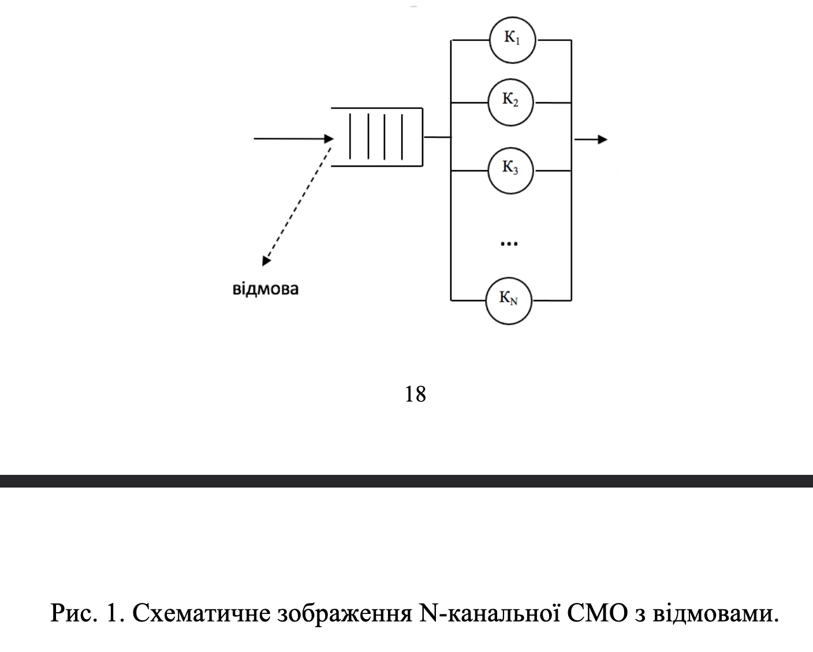

> **Звіт**
>
> з дисципліни «Технології паралельних обчислень» (за змістом курсу)
>
> Комп'ютерний практикум №5
>
> «Застосування високорівневих засобів паралельного програмування для побудови алгоритмів імітації та дослідження їх ефективності»
>
> **[Виконав:]** …
>
> **[Прийняв:]** …
>
> **Київ — 2026**

### Комп'ютерний практикум №5

Практикум присвячений **імітаційному моделюванню** багатоканальної СМО з обмеженою чергою та відмовами на базі **пулу потоків** і подальшому дослідженню результатів. Потрібно закрити пункти з завдання: імітація СМО з оцінкою середньої довжини черги та ймовірності відмови (п.1), паралельні прогони для статистично стійкої оцінки тих самих показників (п.2), динамічний вивід стану в окремому потоці (п.3), теоретичні оцінки ефективності для одного з алгоритмів завдань 2–5 (п.4); опційно — бонус зі **стохастичною мережею Петрі**. Постановка та додаткові вказівки — у файлі завдання до практикуму; орієнтири для паралельних прогонів і відображення імітації узгоджуються з лекційними матеріалами курсу.

---

### Завдання 1

Потрібно змоделювати **N-канальну СМО** з обмеженим буфером: заявки надходять у випадкові моменти (у реалізації — рівномірний інтервал із заданим середнім), час обслуговування — випадковий за **нормальним** законом з обрізанням до додатних значень; якщо є вільний канал, заявка обслуговується одразу, інакше вона стає в чергу, а при переповненні буфера фіксується **відмова**. Кожен канал відтворюється як **окрема підзадача** у фіксованому пулі `ExecutorService`; окремий потік імітує надходження (**producer**), ще один через рівні інтервали знімає довжину **лише черги** для оцінки середнього. Ймовірність відмови — відношення числа відмов до числа спроб входу; прогін триває, доки не обслуговано не менш як **1000** заявок (за методичкою).

> Схема СМО збігається з **Producer–Consumer**: producer постачає заявки в обмежений буфер, «споживачі» відповідають каналам і утримують заявку на час обслуговування; при неможливості зайняти місце в буфері заявка відкидається.

**Рисунок 1.1** — Схема N-канальної СМО з відмовами (джерело до завдання).

У тексті варто посилатися на рисунок 1.1 при поясненні потоків «надходження — черга — канали — вихід».

**Рисунок 1.2** — Скріншот запуску програми після виконання `just task1` у каталозі `lab5/project` (за потреби вставте `` після збереження знімка у `lab5/docs/report/media/`).

Підсумок: для реалізованого варіанту отримано числові оцінки **середньої довжини черги** (за дискретними спостереженнями) та **ймовірності відмови**; конкретні значення залежать від seed і параметрів навантаження, при збільшенні інтенсивності надходження зростають черга й частка відмов.

---

### Завдання 2

Кілька **незалежних прогонів** тієї ж моделі з різними seed виконують **паралельно** (окремі потоки або задачі пулу); після завершення всіх прогонів обчислюють середні оцінки середньої довжини черги та ймовірності відмови. За рекомендаціями до практикуму доцільно не менше **чотирьох** прогонів; головний потік очікує завершення роботи всіх прогонів і агрегує результати.

**Рисунок 2.1** — Приклад таблиці або графіка усереднених показників по прогонах (за даними експерименту; за потреби ``).

---

### Завдання 3

Потрібно виводити **стан моделі** та числові вихідні величини в **окремому потоці** з заданою затримкою, щоб спостерігати за перебігом імітації без змішування з основним обчисленням. Типова схема: один потік виконує модель, інший періодично зчитує знімок стану (черга, зайняті канали, лічильники) і друкує або оновлює відображення.

**Рисунок 3.1** — Фрагмент динамічного виводу або скріншот інтерфейсу (після реалізації п.3; за потреби ``).

---

### Завдання 4

Потрібно побудувати **теоретичні оцінки** показників ефективності для **одного** з алгоритмів практичних завдань 2–5: наприклад, закон Амдала чи оцінки прискорення та ефективності \(S_p\), \(E_p\) для паралельних прогонів з п.2 (лекційний матеріал з моделювання паралельних обчислень), або наближені формули теорії черг для порівняння з імітацією СМО за узгоджених припущень щодо розподілів. У звіті мають бути явно записані припущення, формули та порівняння з експериментом.

**Рисунок 4.1** — Ілюстрація до теоретичного порівняння (графік, таблиця або схема; за потреби ``).

---

### Бонусне завдання

Розробляється **модель паралельних обчислень** у вигляді **стохастичної мережі Петрі** для одного з алгоритмів лабораторних 2–5; досліджується зростання часу виконання паралельного алгоритму при збільшенні розміру даних. Для ідей формалізації та прикладів доцільно звернутися до лекційних матеріалів курсу з Петрі-об’єктного моделювання.

---

### Висновок

У межах практикуму №5 опрацьовано постановку **багатоканальної СМО з обмеженою чергою та відмовами** і реалізовано імітацію з використанням **пулу потоків**, що відповідає вимозі відтворювати канали як окремі підзадачі. Окремий потік спостереження за довжиною черги дозволяє оцінити середнє число заявок у буфері згідно з методичними вказівками; ймовірність відмови виводиться з лічильників спроб і відмов.

Друге завдання має на меті підсилити **статистичну надійність** оцінок за рахунок паралельних незалежних прогонів і усереднення. Третє — зробити перебіг моделі **наочним** завдяки фоновому виводу. Четверте зв’язує експеримент з **теорією** (ефективність паралельних обчислень або наближені моделі черг). Бонусне завдання розвиває зв’язок програмної реалізації з **формальною стохастичною моделлю** (мережа Петрі).

Загалом практикум підкреслює роль **високорівневих** засобів Java (`ExecutorService`, потоки) при побудові імітацій, де важливі коректна синхронізація спільного стану та відокремлення обчислення від спостереження за результатами. Подальше завершення пунктів 2–4 і бонусу доповнить звіт експериментальними рисунками та теоретичним порівнянням у тому ж форматі, що й для рисунків 2.1–4.1.
