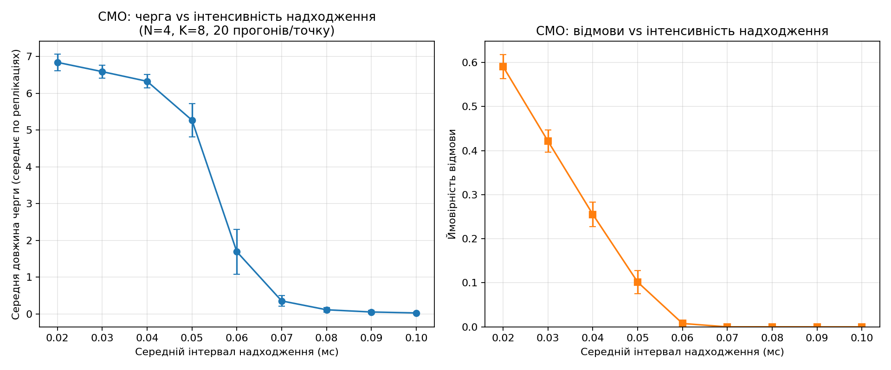
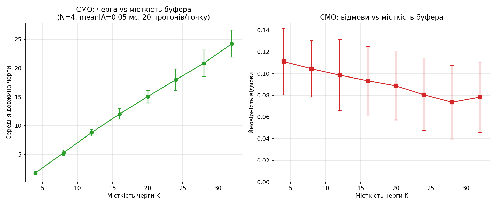
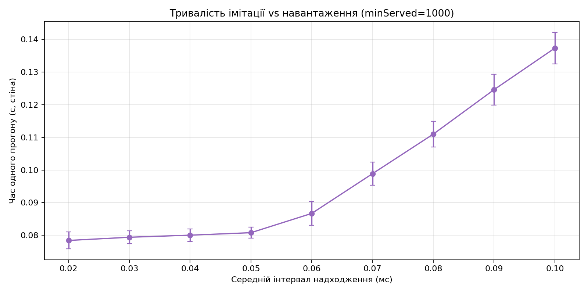

> **Звіт**
>
> з дисципліни «Технології паралельних обчислень» (за змістом курсу)
>
> Комп'ютерний практикум №5
>
> «Застосування високорівневих засобів паралельного програмування для побудови алгоритмів імітації та дослідження їх ефективності»
>
> **[Виконав:]** …
>
> **[Прийняв:]** …
>
> **Київ — 2026**

### Комп'ютерний практикум №5

Практикум присвячений **імітаційному моделюванню** багатоканальної СМО з обмеженою чергою та відмовами на базі **пулу потоків** і подальшому дослідженню результатів. Потрібно закрити пункти з завдання: імітація СМО з оцінкою середньої довжини черги та ймовірності відмови (п.1), паралельні прогони для статистично стійкої оцінки тих самих показників (п.2), динамічний вивід стану в окремому потоці (п.3), теоретичні оцінки ефективності для одного з алгоритмів завдань 2–5 (п.4); опційно — бонус зі **стохастичною мережею Петрі**. Постановка та додаткові вказівки — у файлі завдання до практикуму; орієнтири для паралельних прогонів і відображення імітації узгоджуються з лекційними матеріалами курсу.

---

### Завдання 1

Потрібно змоделювати **N-канальну СМО** з обмеженим буфером: заявки надходять у випадкові моменти (у реалізації — рівномірний інтервал із заданим середнім), час обслуговування — випадковий за **нормальним** законом з обрізанням до додатних значень; якщо є вільний канал, заявка обслуговується одразу, інакше вона стає в чергу, а при переповненні буфера фіксується **відмова**. Кожен канал відтворюється як **окрема підзадача** у фіксованому пулі `ExecutorService`; окремий потік імітує надходження (**producer**), ще один через рівні інтервали знімає довжину **лише черги** для оцінки середнього. Ймовірність відмови — відношення числа відмов до числа спроб входу; прогін триває, доки не обслуговано не менш як **1000** заявок (за методичкою).

> Схема СМО збігається з **Producer–Consumer**: producer постачає заявки в обмежений буфер, «споживачі» відповідають каналам і утримують заявку на час обслуговування; при неможливості зайняти місце в буфері заявка відкидається.

**Рисунок 1.1** — Схема N-канальної СМО з відмовами (джерело до завдання).

У тексті варто посилатися на рисунок 1.1 при поясненні потоків «надходження — черга — канали — вихід».

**Рисунок 1.2** — Скріншот запуску після **`just task1`** (швидкий один прогін) у каталозі `lab5/project` (за потреби вставте `` після збереження знімка у `lab5/docs/report/media/`).

Для **масового експерименту** у каталозі [`lab5/project`](../../project) виконують **`just task1-plots`**: клас **`Task1Benchmark`** записує у `lab5/project/results/lab5_by_load.csv` прогони при зміні середнього інтервалу надходження (0.02…0.10 мс, крок 0.01; **20 реплік** на точку, \(N=4\), \(K=8\)), а у `lab5_by_queue.csv` — при \(K\in\{4,8,\ldots,32\}\) при фіксованому `meanIA=0.05` мс; скрипт `lab5_plots` будує PNG. Для звіту копії графіків зібрано в каталозі [`lab5/docs/results/task1`](../results/task1); усереднення в таблицях 1.1–1.2 зроблено по колонках CSV (по 20 реплік на кожну комбінацію параметрів).

**Таблиця 1.1** — Усереднені по реплікаціях оцінки при зміні середнього інтервалу надходження (\(N=4\), \(K=8\)); відповідає серії `by_load` і **рисунку 1.3**.

| meanIA, мс | Середня довжина черги | Ймовірність відмови |
|------------|----------------------:|--------------------:|
| 0.02 | 6.84 | 0.590 |
| 0.03 | 6.59 | 0.421 |
| 0.04 | 6.33 | 0.255 |
| 0.05 | 5.27 | 0.102 |
| 0.06 | 1.69 | 0.008 |
| 0.07 | 0.36 | 0.000 |
| 0.08 | 0.12 | 0.000 |
| 0.10 | 0.03 | 0.000 |

За **рисунком 1.3** і таблицею 1.1 видно різкий перехід режиму в діапазоні **0.05–0.06 мс**: при меншому середньому інтервалі (вища інтенсивність надходження) система близька до насичення — середня довжина черги та \(P_{\mathrm{reject}}\) великі; після ~0.06 мс відмови зникають, черга швидко спадає до значень близько нуля. Поблизу порогу (0.06 мс) на графіку помітніші **стовпчики похибок** — більша розкидність реалізацій стохастичного процесу.

**Таблиця 1.2** — Усереднені показники vs місткість буфера при `meanIA=0.05` мс (\(N=4\)); відповідає серії `by_queue` і **рисунку 1.4**.

| \(K\) | Середня довжина черги | Ймовірність відмови |
|------:|----------------------:|--------------------:|
| 4 | 1.80 | 0.111 |
| 8 | 5.29 | 0.104 |
| 16 | 12.05 | 0.093 |
| 24 | 17.99 | 0.080 |
| 32 | 24.26 | 0.078 |

За **рисунком 1.4** і таблицею 1.2 збільшення \(K\) при фіксованій інтенсивності надходження **підвищує середню довжину черги** (більше заявок утримується в буфері замість відсікання) і **помітно знижує ймовірність відмови** — з ~0.11 при \(K=4\) до ~0.08 при \(K=32\). Зниження \(P_{\mathrm{reject}}\) поступове; дисперсія оцінки відмови по реплікаціях більша, ніж для середньої довжини черги (видно на рисунку 1.4).

**Рисунок 1.3** — Середня довжина черги та ймовірність відмови vs середній інтервал надходження (середнє та похибка по 20 реплікаціях; файл у [`lab5/docs/results/task1`](../results/task1)).

**Рисунок 1.4** — Ті самі показники vs місткість черги при `meanIA=0.05` мс.

**Рисунок 1.5** — Середній стіновий час **одного** прогону імітації (умова зупинки: не менше 1000 обслугованих заявок) vs середній інтервал надходження. При **більшій** інтервалі (слабше навантаження) заявки надходять рідше, тому до досягнення 1000 обслугованих потрібно **більше модельного часу** і довший реальний час прогону: наприклад, усереднено ~0.078 с при 0.02 мс і ~0.137 с при 0.10 мс (за тими самими CSV, що й для рис. 1.3). На ділянці 0.02–0.05 мс час прогону майже плоский, далі зростає майже лінійно — узгоджено з тим, що модель швидше «набирає» 1000 обслуг при сильнішому потоці заявок.

Підсумок: експеримент підтверджує очікувану залежність **навантаження → черга й відмови** (рис. 1.3, табл. 1.1) і роль **ємності буфера** при фіксованій інтенсивності (рис. 1.4, табл. 1.2); **рисунок 1.5** пояснює, чому порівняння тривалості прогонів при різних `meanIA` потрібно інтерпретувати з урахуванням критерію зупинки за кількістю обслугованих заявок.

---

### Завдання 2

Кілька **незалежних прогонів** тієї ж моделі з різними seed виконують **паралельно** (окремі потоки або задачі пулу); після завершення всіх прогонів обчислюють середні оцінки середньої довжини черги та ймовірності відмови. За рекомендаціями до практикуму доцільно не менше **чотирьох** прогонів; головний потік очікує завершення роботи всіх прогонів і агрегує результати.

**Рисунок 2.1** — Приклад таблиці або графіка усереднених показників по прогонах (за даними експерименту; за потреби ``).

---

### Завдання 3

Потрібно виводити **стан моделі** та числові вихідні величини в **окремому потоці** з заданою затримкою, щоб спостерігати за перебігом імітації без змішування з основним обчисленням. Типова схема: один потік виконує модель, інший періодично зчитує знімок стану (черга, зайняті канали, лічильники) і друкує або оновлює відображення.

**Рисунок 3.1** — Фрагмент динамічного виводу або скріншот інтерфейсу (після реалізації п.3; за потреби ``).

---

### Завдання 4

Потрібно побудувати **теоретичні оцінки** показників ефективності для **одного** з алгоритмів практичних завдань 2–5: наприклад, закон Амдала чи оцінки прискорення та ефективності \(S_p\), \(E_p\) для паралельних прогонів з п.2 (лекційний матеріал з моделювання паралельних обчислень), або наближені формули теорії черг для порівняння з імітацією СМО за узгоджених припущень щодо розподілів. У звіті мають бути явно записані припущення, формули та порівняння з експериментом.

**Рисунок 4.1** — Ілюстрація до теоретичного порівняння (графік, таблиця або схема; за потреби ``).

---

### Бонусне завдання

Розробляється **модель паралельних обчислень** у вигляді **стохастичної мережі Петрі** для одного з алгоритмів лабораторних 2–5; досліджується зростання часу виконання паралельного алгоритму при збільшенні розміру даних. Для ідей формалізації та прикладів доцільно звернутися до лекційних матеріалів курсу з Петрі-об’єктного моделювання.

---

### Висновок

У межах практикуму №5 опрацьовано постановку **багатоканальної СМО з обмеженою чергою та відмовами** і реалізовано імітацію з використанням **пулу потоків**, що відповідає вимозі відтворювати канали як окремі підзадачі. Окремий потік спостереження за довжиною черги дозволяє оцінити середнє число заявок у буфері згідно з методичними вказівками; ймовірність відмови виводиться з лічильників спроб і відмов. Для завдання 1 узагальнено експериментальні ряди (табл. 1.1–1.2, рис. 1.3–1.5 у [`lab5/docs/results/task1`](../results/task1)) щодо впливу інтенсивності надходження, місткості буфера та критерію зупинки на метрики СМО.

Друге завдання має на меті підсилити **статистичну надійність** оцінок за рахунок паралельних незалежних прогонів і усереднення. Третє — зробити перебіг моделі **наочним** завдяки фоновому виводу. Четверте зв’язує експеримент з **теорією** (ефективність паралельних обчислень або наближені моделі черг). Бонусне завдання розвиває зв’язок програмної реалізації з **формальною стохастичною моделлю** (мережа Петрі).

Загалом практикум підкреслює роль **високорівневих** засобів Java (`ExecutorService`, потоки) при побудові імітацій, де важливі коректна синхронізація спільного стану та відокремлення обчислення від спостереження за результатами. Подальше завершення пунктів 2–4 і бонусу доповнить звіт експериментальними рисунками та теоретичним порівнянням у тому ж форматі, що й для рисунків 2.1–4.1.
